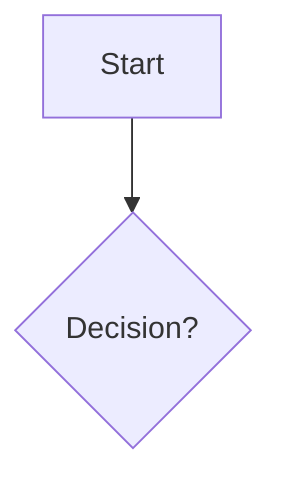

# AGENTS.md

이 문서는 이 레포에서 OpenCode/OhMyOpenCode 에이전트가 따라야 하는 **운영 규칙(강제)**입니다.

## 0) 문서 위치(SSoT)

- 기획 산출물 정본은 `product-description/` 아래에만 둡니다.
- 어떤 자동화/검증도 기본 타깃은 `product-description/**` 입니다.

## 1) 최초 요청 시 필수: 웹 리서치(유사 서비스 + 정책)

새로운 기획(새 프로젝트/새 도메인)의 **최초 요청**이 들어오면, 아래를 반드시 수행합니다.

### 1.1 리서치 내용(필수 섹션)

1) 유사 제품/서비스 6개 이상 목록(링크 포함, 정책 패턴 포화 시 조기 종료 가능)
2) 각 서비스의 정책 패턴 요약(Privacy/AI terms 중심)
   - 학습(Training) 사용 여부
   - 보관/삭제(Retention/Deletion)
   - 서브프로세서(Subprocessors)
   - 관리자 제어(Admin controls)
   - 권한/경계(Permissioning)
3) 우리 제품/문서 정책으로 가져올 최소 요건(체크리스트)

### 1.2 산출물 위치(필수)

- `product-description/ko/00-competitive-and-policy-research.md`
- `product-description/en/00-competitive-and-policy-research.md`

> 리서치 없이 플로우차트/문서 작성 단계로 넘어가지 않습니다.

## 2) 상태 머신 + 게이트(강제)

### 상태

- `DRAFT_FLOW` → `REVIEW_FLOW` → `APPROVED_FLOW` → `DOC_GEN` → `DOC_REVIEW` → `FINALIZED`

### 게이트 규칙(중요)

- `APPROVED_FLOW` 이전에는 **DOC_GEN 금지**
- `DOC_REVIEW` 중 플로우 변경이 발생하면 **REVIEW_FLOW로 롤백**하고 로그를 남김

## 3) 로그 정책(강제)

모든 결정/변경은 Markdown 로그에 **append-only**로 남깁니다.

- 승인 로그: `product-description/shared/20_approval.md`
- 결정 로그: `product-description/shared/30_decisions.md`
- 논리/리스크 로그: `product-description/shared/risk.md`

각 로그는 최소한 아래 정보를 포함해야 합니다.

- 누가(Owner)
- 언제(타임스탬프)
- 무엇을(변경/결정 대상)
- 왜(근거)
- 대안(검토한 옵션)
- 결정(선택)
- 영향 범위(Flow node / 문서 섹션)

## 4) Mermaid(강제)

플로우차트는 항상 Mermaid fenced block로 작성합니다.

```md

```

## 5) 작업 종료 직전 검증(강제)

모든 작업은 종료 직전에 아래 명령을 실행합니다.

```bash
npm run verify
```

권장 구성:
- `verify:spelling` (cspell + 한글 맞춤법)
- `verify:mermaid` (Mermaid 문법 검증)
- `verify:logical` (opencode run 기반 논리 검증 → risk.md 기록)

## 6) OpenCode Web UI / Antigravity 운영(선택)

- Web UI: `opencode web`
- Antigravity OAuth: `opencode auth login` + `opencode-antigravity-auth` 플러그인 설정

자세한 에이전트 역할/프롬프트 템플릿은 `product-description/rules/agents/`에 정의합니다.
