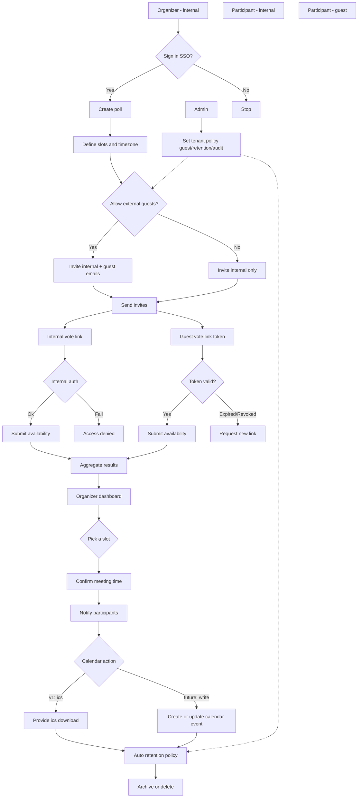

# 03. Flow & UX (Mermaid)

State: `DRAFT_FLOW`

Date: 2026-01-30

## Core flow (v1)

## UX notes (draft)

- Poll creation: title/description, timezone, slot input helpers, guest toggle.
- Voting: show converted times, 3-state choices, low-friction guest path.
- Results: aggregation and confirmation, then `.ics` download.
