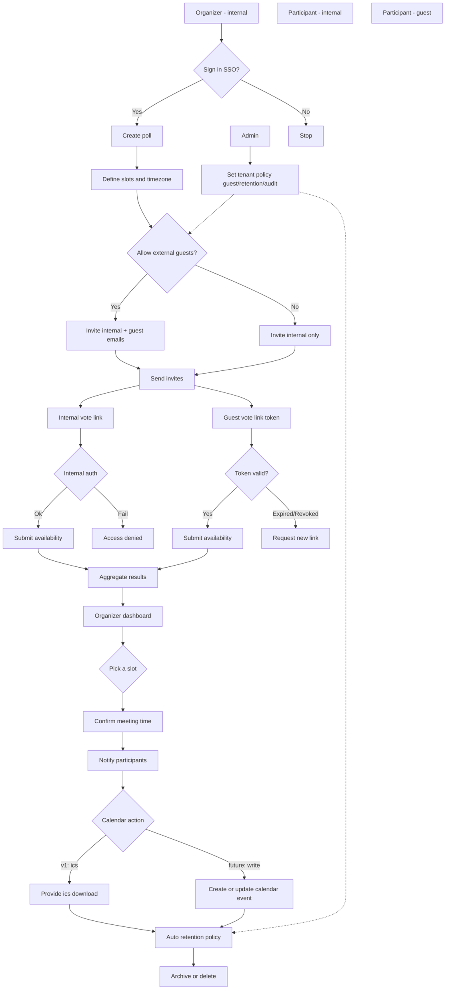

# 03. 플로우 & UX (Mermaid 포함)

상태: `DRAFT_FLOW`

작성일: 2026-01-30

## 1) 핵심 플로우 (v1)

## 2) 화면/UX 구성(초안)

### 2.1 폴 생성 화면

- 제목/설명
- 기본 타임존 선택
- 후보 슬롯 입력(반복 입력 보조)
- 외부 게스트 허용 토글(테넌트 정책에 의해 비활성화 가능)

### 2.2 초대 화면

- 사내 사용자 선택(검색/이메일)
- 외부 게스트 이메일 입력
- 초대 메시지 템플릿

### 2.3 투표 화면(참석자)

- 슬롯이 “내 타임존”으로 표시
- 3-state 응답(가능/불가/조건부)
- (외부 게스트) 이메일 확인이 필요한 경우 최소 입력으로 완료

### 2.4 결과/확정 화면(Organizer)

- 슬롯별 집계(가능 인원, 조건부 포함)
- “최적 슬롯 추천”은 v1에서는 룰 기반(단순 합산)으로 시작
- 확정 후 공유 링크 + (v1) .ics 다운로드

## 3) 엣지 케이스(초안)

- 공통 가능한 슬롯이 없는 경우: 추가 슬롯 제안 / 재투표
- 게스트 링크 유출 리스크: 링크 만료/재발급, 이메일 바인딩 옵션
- 시간대 변경/서머타임: IANA timezone 기준 변환
