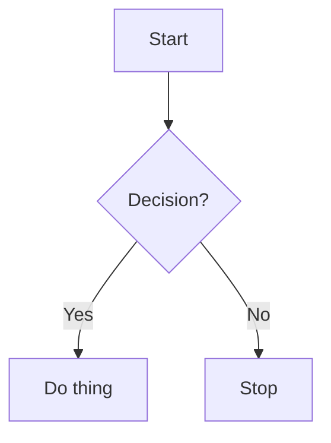

# 03. Flow & UX (Mermaid)

State: `DRAFT_FLOW`

Date: YYYY-MM-DD

## Core flow (v1)

```mermaid
flowchart TD
  A[Start] --> B{Decision?}
  B -->|Yes| C[Do thing]
  B -->|No| D[Stop]
```

## UX notes (draft)

- <Key screen/interaction>
