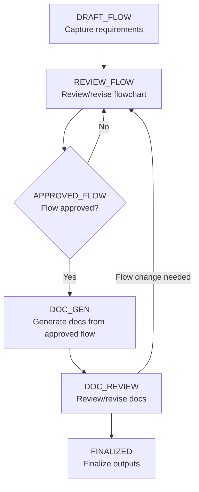

# Workflow (State Machine) & Gates

Version: v1.0
Date: 2026-01-30

## 1) State machine

## 2) Hard gates

- Research-first gate: update `en/00-competitive-and-policy-research.md` before drafting the flow.
- Approval gate: no DOC_GEN before an APPROVED entry exists in `shared/20_approval.md`.
- Decision log gate: append decisions/changes to `shared/30_decisions.md`.

## 3) End-of-work verification

Run `npm run verify`.
