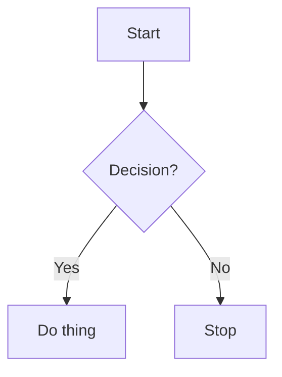

# 03. 플로우 & UX (Mermaid)

상태: `DRAFT_FLOW`

작성일: YYYY-MM-DD

## 1) 핵심 플로우(v1)

```mermaid
flowchart TD
  A[Start] --> B{Decision?}
  B -->|Yes| C[Do thing]
  B -->|No| D[Stop]
```

## 2) UX 메모(초안)

- <주요 화면/상호작용>
