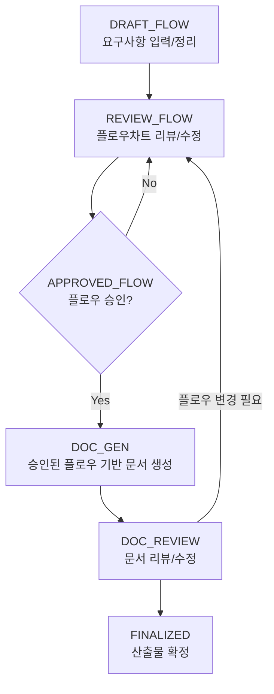

# 워크플로우(상태 머신) & 게이트 규칙

버전: v1.0
작성일: 2026-01-30

## 1) 상태 머신

## 2) 강제 게이트

### G1. 최초 요청(리서치) 게이트

- **차단 조건**: `ko/00-competitive-and-policy-research.md`가 없거나, 최신 기획에 대한 내용이 비어 있음
- **허용 조건**: 최소 6개 유사 서비스 + 정책 패턴 요약 + 체크리스트가 포함되어 있음

### G2. 플로우 승인 게이트

- **차단 조건**: `shared/20_approval.md`에 해당 플로우에 대한 "APPROVED" 기록이 없음
- **허용 조건**: 승인 기록이 append 되었고, 승인 대상(무엇/왜/영향)이 명확함

### G3. 결정 로그 게이트

- **규칙**: 플로우/정책/핵심 요구사항에 변화가 생기면 반드시 `shared/30_decisions.md`에 append

## 3) 종료 직전 검증(필수)

- `npm run verify`
  - `verify:spelling`: 맞춤법/용어
  - `verify:mermaid`: Mermaid 문법
  - `verify:logical`: (best-effort) 논리적 모순/누락 스캔 → `shared/risk.md`에 append
